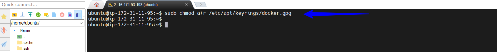
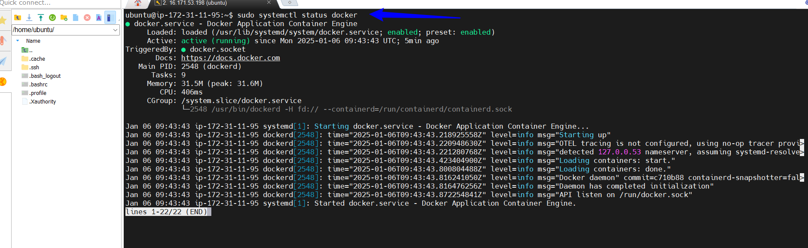

#  Docker

# Introduction to Docker and Containers

## What are Containers

Containers are a lightweight form of virtualization that package an application and its dependencies together so that it can run consistently across different computing environments. Here's a breakdown of what containers are and their key characteristics:

## Key Characteristics of Containers:

### Isolation:

Each container operates in its own isolated environment, with its own file system, process space, and network stack. This ensures that applications running inside containers do not interfere with one another.

### Consistency:

Containers package an application with all its dependencies, including libraries, binaries, and configuration files. This guarantees that the application will run the same way, regardless of where it is deployed (e.g., on a developer's laptop, in a test environment, or in production).

### Lightweight:

Containers share the host operating system's kernel, which makes them more lightweight and faster to start compared to traditional virtual machines. This also means they consume fewer resources.

### Portability:

Containers can be easily moved between different environments, such as between development, testing, and production, without any changes to the code.

### Scalability:

Containers can be easily scaled up or down to handle varying levels of traffic. They can be orchestrated using tools like Kubernetes to manage large numbers of containers in a coordinated manner.

## Comparison of Docker Containers with Virtual Machines

Docker containers and virtual machines (VMs) are both used for virtualization, but they differ in several ways:

#### Architecture:

`Docker Containers`: Share the host OS kernel, isolating applications at the process level. They use fewer resources and start faster.

`Virtual Machines`: Include a full OS and hypervisor, which virtualizes hardware. Each VM runs its own OS, consuming more resources.

#### Resource Efficiency:

`Docker Containers`: Lightweight, as they share the host OS and its resources. Efficient for running multiple applications on the same host.

`Virtual Machines`: Heavy, as each VM needs its own OS, leading to higher resource usage.

#### Portability:

`Docker Containers`: Easily portable across different environments, ensuring consistent performance.

`Virtual Machines`: Less portable, as they depend on the underlying hypervisor and hardware configuration.

#### Use Cases:

`Docker Containers`: Ideal for microservices, continuous integration/continuous deployment (CI/CD), and applications that need rapid scaling.

`Virtual Machines`: Suitable for running different OSes, isolating applications that need strong separation, and legacy applications.

## Importance of DOCKER
Docker is important for modern software development due to several key reasons:

#### Portability: 
Docker containers package applications with all their dependencies, ensuring they run consistently across different environments.

#### Efficiency:
 Containers are lightweight and share the host OS, leading to faster startup times and lower resource consumption compared to virtual machines.

#### Scalability: 
Docker makes it easy to scale applications up or down to handle varying loads, facilitating rapid deployment and management.

#### Isolation: 
Containers provide process and file system isolation, ensuring that applications run in their own environments without interference.

#### Continuous Integration/Continuous Deployment (CI/CD): 
Docker streamlines the development and deployment process, making it easier to implement CI/CD pipelines and improve workflow efficiency.

## Getting Started With Docker
### Installing DOCKER

We need to launch an UBUNTU 24.04 LTS instance and connect to it.Then follow the steps below.
Before installing a DOCKER engine for the first time on a new host machine, it is important to configure the docker repository. Following these steps,we can proceed to install and update docker directly from the Docker repository.

* Update the debian system: This is the linux command that refreshes the package list on a Debian-base system ensuring the latest software information is available for installation.

      sudo apt-get update
   

    
* Add the Docker official GPG key

      sudo apt-get install ca-certificates curl gnupg

    
    

    This is the linux command that installs essential packages including certificate authorities,data transfer tool `curl` and the GNU Privacy Guard for secure communication and package verification.

* The command below creates a directory (/etc/apt/keyrings) with permissions 0755 for storing keyrings files which are used for docker authentication.

       sudo install -m 0755 -d /etc/apt/keyrings

  

* Download the Docker GPG Key: The command below download the docker GPG key using `curl`

      curl -fsSL https://download.docker.com/linux/ubuntu/gpg | sudo gpg --dearmor -o /etc/apt/keyrings/docker.gpg
 
   

* Set permissions for all users on the Docker GPG Key file within the APT Keyring directory.

      sudo chmod a+r /etc/apt/keyrings/docker.gpg

   

* Add the repository to APT sources
   
       echo \
       "deb [arch=$(dpkg --print-architecture) signed-by=/etc/apt/keyrings/docker.gpg] 
       https://download.docker.com/linux/ubuntu \
       $(. /etc/os-release && echo "$VERSION_CODENAME") stable" | \
       sudo tee /etc/apt/sources.list.d/docker.list > /dev/null

     

* Update the latest version of Docker

      sudo apt-get update

   

* Install latest version of Docker 

       sudo apt-get install docker-ce docker-ce-cli containerd.io docker-buildx-plugin docker-compose-plugin
   
    

* Verify Docker has been successfully installed.

      sudo systemctl status docker

  
 

* By default, after installing Docker,it can only be run by root user or by using `sudo` command. To run the docker command without sudo, execute the command below.

      sudo usermod -aG docker ubuntu

 
    

## Running the DOCKER " Hello World" Container.

#### Using the `docker run` command

The Docker run command is the entry point to execute containers in docker.It allows you to create and start a container based on a specified Docker image.The most straight forward example is the "Hello World" container, a minimalistic container that prints a greeting message when executed.

     # Run the "Hello World" container
       docker run hello-world

 

 When you execute this command,Docker performs the following steps.

 1.**Pull Image (If not available locally)** : Docker checks if the "hello world" image is available locally.If not,it automatically pulls it from the Docker Hub, a centralized repository for Docker images.

 2.**Creates a Container** : Docker creates a container based on the "Hello world" image .This container is an instance of the image, with its own isolated filsystem and runtime environment.

 3.**Start the  Container** : The container is started and it executes the predetermined command in the Hello world image, which prints a friendly message.

 ## Understanding Docker Image and Container Lifecycle.

 **Docker Image** : A Docker image is a lightweight, standalone,and executable packages that includes everything needed to run a piece of software, including the code, runtime,libraries, and system tools.Images cannot be modified once created. Changes result in the creation of new image. 

**Container Lifecycle**.

Containers are running instances of docker images

* They have a lifecycle ` create, start,stop and delete`
* Once a container is created from an image,it can be started,stopped and restarted.

## Verifying Successful Execution

You can check if the images is now in your local environment

    docker images
   
   

# Basic Docker Commands

`Docker run`
The docker run is fundamental for executing containers. It creates and starts a container based on a specified image.

    # Run a container based on the "nginx" image
      docker run hello-world

This example pulls the ngnix image from docker Hub(if its not available locally) and starts a container using this image.

`Docker PS` The ps command displays a list of running containers. This is useful for monitoring active containers and obtaining information such as container IDs,names and status.

    # List running containers
    docker ps
To view all containers including those that have stopped, add the `a` option.

    # List all containers (running and stopped)
    docker ps -a

 

`Docker stop` The docker stop halts a running container.

    # Stop a running container (replace CONTAINER_ID with the # actual container ID)
    docker stop CONTAINER_ID

`Docker pull` The docker pull downloads an image from the docker registry such as Docker Hub to your local machine.

    # Pull the latest version of the "ubuntu" image from Docker Hub
    docker pull ubuntu

`Docker push` The docker push uploads a local a local Docker image to a registry, making it available for others to pull.

    # Push a local image to Docker Hub
    docker push your-username/image-name

Ensure you logged in to Docker Hub using the `docker login` before pushing images.

`Docker Images` The docker images lists all locally available docker images

    # List all local Docker images
    docker images

`Docker RMI` The docker rmi remove one or more images from the local machine.

    # Remove a Docker image (replace IMAGE_ID with the actual image ID)
    docker rmi IMAGE_ID

These basic commands provide a foundation for working with containers.Understanding how to run,list,stop,pull, push and remove and manage docker images are crucial for effective containerization and orchestration.

